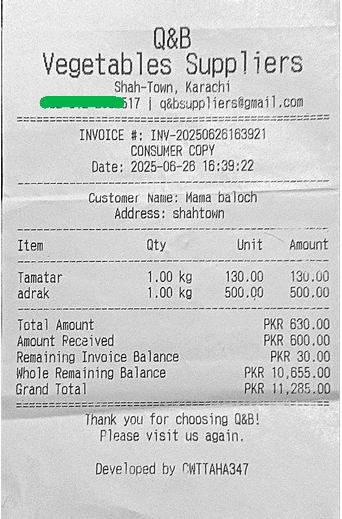
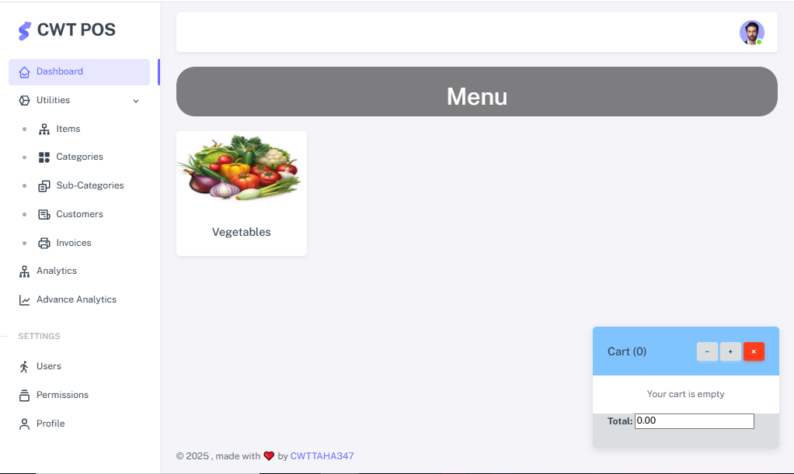
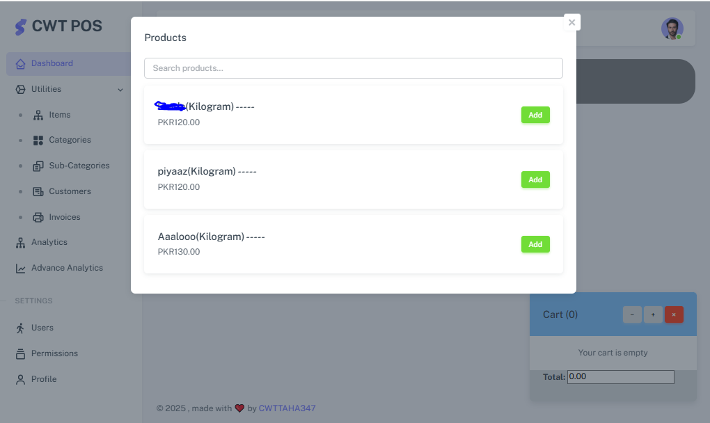
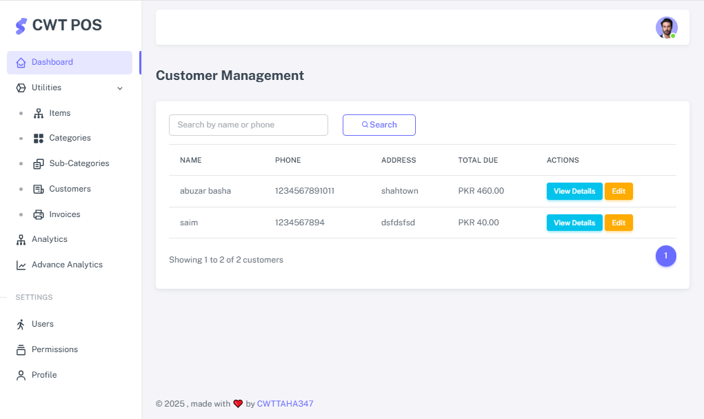

# 🧾 CWT POS - Complete Point of Sale & Financial Management System

 <!-- Replace or remove if you have a specific logo -->

CWT POS (Cloud + Local) is a comprehensive **Point of Sale (POS)** system designed for businesses to **manage billing, invoices, inventory, and finances**, both **online and offline**. It seamlessly integrates a **local bot system** and a **centralized online platform**, allowing smart sync between local sales counters and remote financial dashboards.

🔗 **Live Demo / Website**: [https://qb-suppliers.com/](https://qb-suppliers.com/)

---

## 🚀 Features

### 💰 Point of Sale & Billing
- Instant product  billing
- Custom invoice generation

### 📦 Inventory Management
- Product stock tracking
- Alerts for low inventory
- Product categories and management

### 📊 Financial Dashboard
- Daily, weekly, and monthly sales reports
- Profit/loss analytics
- Vendor and customer payment tracking

### 🧠 Smart Sync System
- Offline local POS bot
- Auto-sync with cloud for backup and reporting

### 👥 User Roles & Security
- Admin, Cashier, Inventory Manager roles
- Login tracking and permission-based access
- Secure data transactions and backups

---

## 📷 Screenshots

> 🔻 _Images will be updated soon as provided_

### 🧾 Sample Receipt  

### 📊 Dashboard Overview  

---

## 🛠️ Tech Stack

- **Frontend**: HTML, CSS, JavaScript, jQuery, Bootstrap  
- **Backend**: PHP (Core), MySQL  
- **Sync Engine**: PHP API  
- **Hosting**: Shared/VPS with Database Encryption Support  

---

